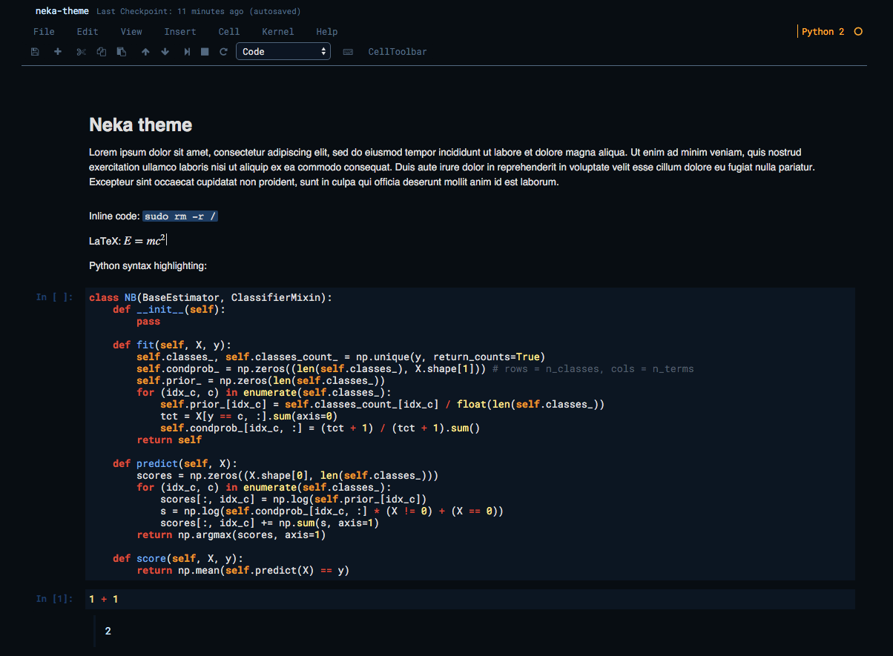

# Themes for IPython/Jupyter Notebook

Custom themes for IPython Notebook or Jupyter Notebook, matching Sublime themes.

## To install:
Copy the `custom.css` file to `~/.jupyter/custom/custom.css` and reload the page.

## Neka theme
Based on https://packagecontrol.io/packages/Neka%20Theme

